

# Flashcodes

### Flashcodes === Flashcards

[Live Site - Demo can be played in Javascript Quirks](https://flashcodes-autumn-hacks.netlify.app/login)

[Demo Video](https://studio.youtube.com/video/N-kuwRpB6qk/edit)

[Figma](https://www.figma.com/file/VXSIT4Lb3N3GV0lCsAth1n/Flashcode?node-id=0%3A1)

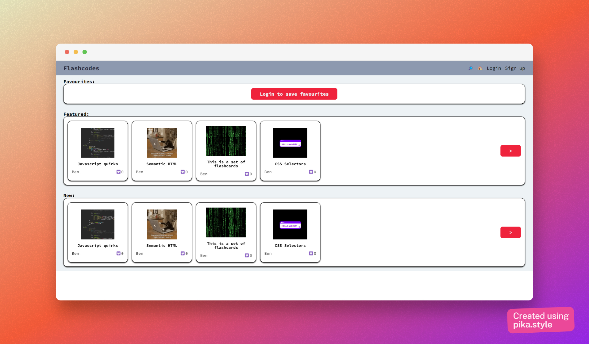

## About the project ❓

---

This project was build for [Autumnnhacks](https://heartsoflove.github.io/autumnnhacks/). This is my first time taking part in a hackathon and it has been tiring, but a ton of fun!

There were 3 topics for the hackathon:

-   Education
-   Social Good
-   Health Care

Straightaway I knew that Education was the perfect topic for me since I'm an English teacher.

## The problem 🤔

Many websites that teachers can use for gamification in the classroom would be a terrible choice for a teacher in a programming class. Code looks better with correct indentation and syntax hightlighting. Imagine trying to have fun with kids or teens in a class by showing them a black and white GitHub Gist. Those would be some very sleepy kids.

## The solution 💡

A gamification platform that allows either syntax highlighting natively, or via an API.

One solution could be PrismJs, that would allow me to display code with syntax highlighting in the browser. It wouldn't have an implementation cost, a part from time of course and is probably a great first option.

But...

Aren't those colourful code snippets you see on social media just so eyecatching?

With that in mind I went searching for an API and I found [Snappify](https://snappify.io/). Unlike other similar sites, this one has an API. The only catch is that it is not free.

The code snippets I generated for the demo come from [Ray.so](https://ray.so/). Ray.so has a script so it could also be possible try to set up my own API endpoint and create the code snippets that way.

## How the game works 🎯

This game would be run on an overhead projector by a teacher in a classroom with students, or screen sharing in an online class.

Students are split into teams, and each team takes it in turn to answer a question. If the team gets it correct then they are awarded points. Of course, the team with the highest points wins.

### Game tiles the teacher would project

### Front of the Flashcodes

### Back of the Flashcodes

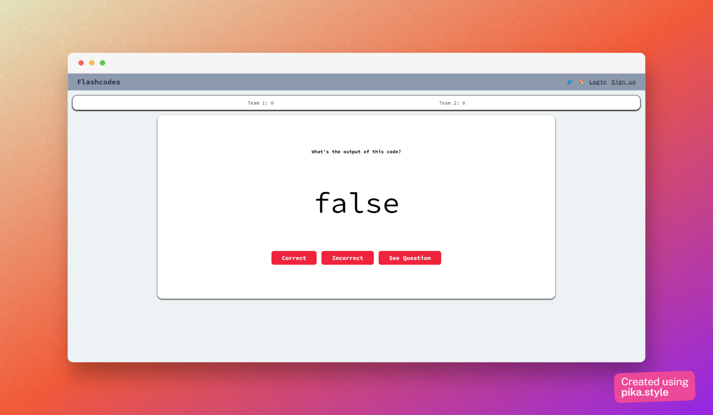

### Built with ⚒️

**Front End**

-   ReactJs
-   CSS
-   Typescript
-   Hosted on Netlify

**Back End (as a service)**

-   Firebase

### What I learned from this project

This project was a great experience. I improved my skills with Figma since it's the first time I've decided to actually take the time and create several pages.

Since I'm learning Typescript at the moment, it was also a good chance to further my knowledge there, though I must admit, I used "any" a bit too much just to save time. There are also a few ".jsx" files here and there. I think that was tiredness more than anything else, I'll go back and convert them soon.

Finally, it was a good chance to learn about Firebase, since a few months ago I tried and gave up. I really spent a lot of time in the docs and managed to get both the authentication and Cloud Firestore working correctly.

### Next steps

-   Experiment with PrismJs
-   Finish unauthenticated happy path
-   Finish authenticated happy path
-   Allow users to create games
-   Allow users to favourite games
-   Allow users to edit games

### Demo Questions

Here are the questions I used in the demo. I created them all from reading through [wtfjs](https://github.com/denysdovhan/wtfjs).

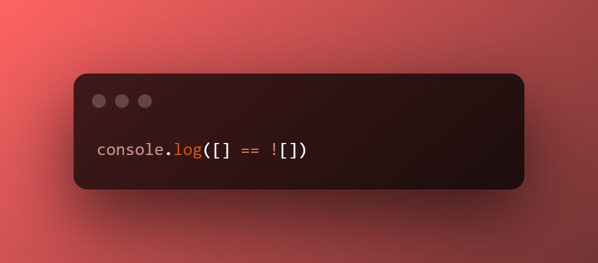

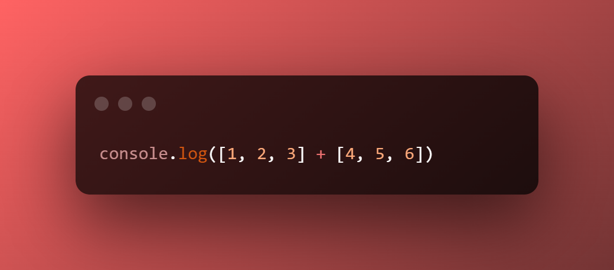
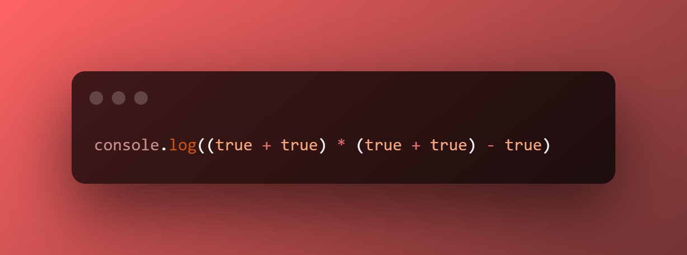
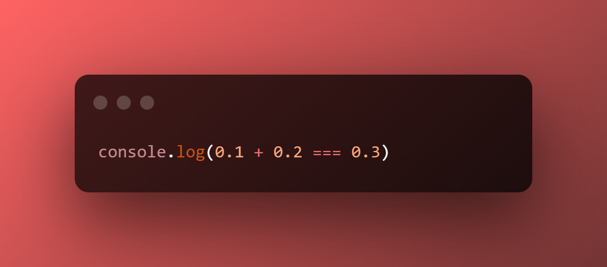
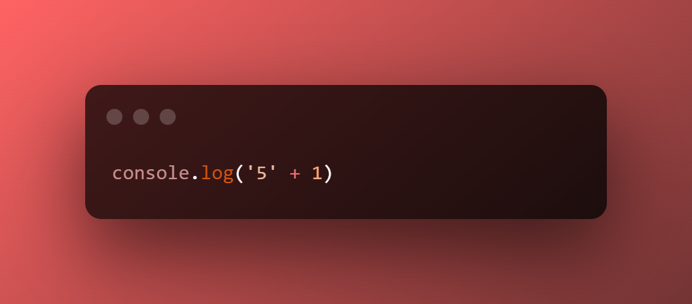
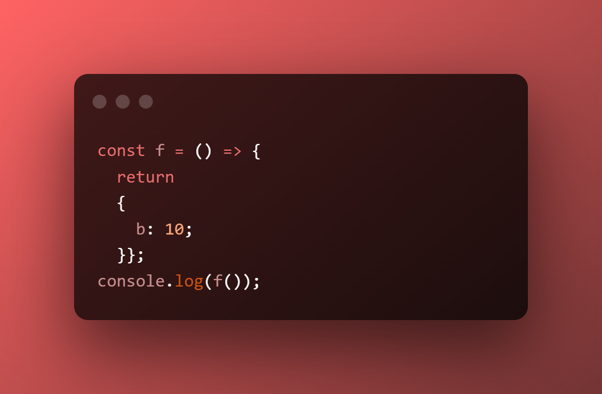
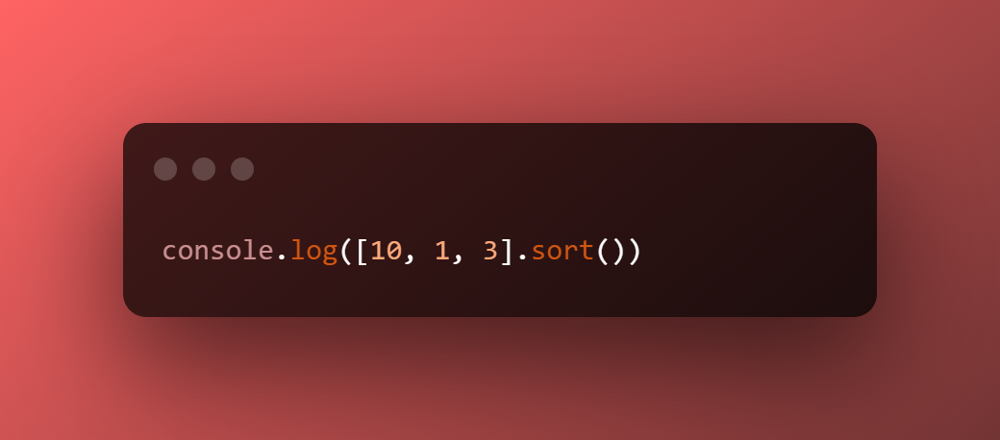
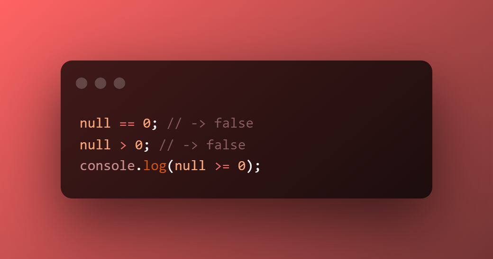
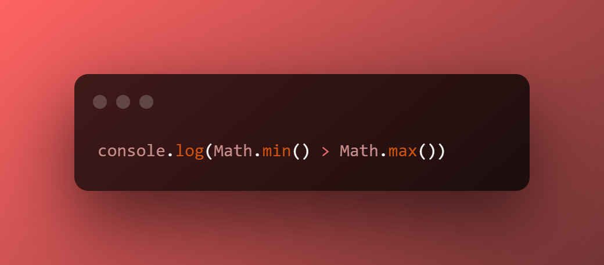

